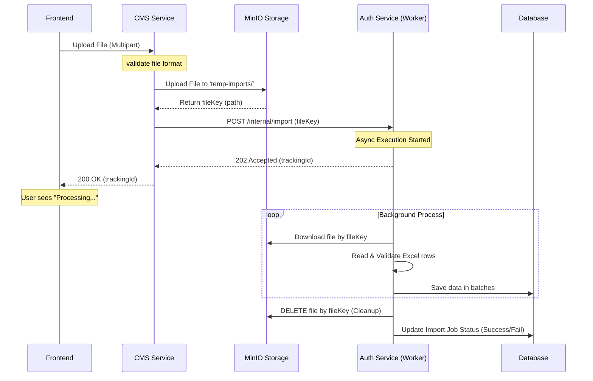

# Luồng xử lý File Import Tối ưu (Async + Shared Storage)

Tài liệu này mô tả kiến trúc xử lý import dữ liệu từ file Excel/CSV trong hệ thống Microservices của Thaca, nhằm giải quyết vấn đề hiệu năng và giới hạn tài nguyên khi truyền file trực tiếp giữa các service.

## 1. Vấn đề của luồng truyền thống (Direct Transfer)

Trong luồng truyền thống, file được truyền từ `Frontend` -> `CMS` -> `Auth` qua giao thức HTTP Multipart.

- **Băng thông**: File lớn làm nghẽn đường truyền giữa các microservices.
- **Bộ nhớ (RAM)**: Các service phải nạp file vào RAM để xử lý, dễ gây lỗi `OutOfMemory` nếu nhiều người dùng cùng import.
- **Timeout**: Người dùng phải chờ kết quả xử lý trong thời gian dài, dễ gặp lỗi Gateway Timeout (504).

## 2. Kiến trúc đề xuất (Shared Storage + Async)

Sử dụng **MinIO** (hoặc S3) làm kho lưu trữ trung gian và cơ chế **xử lý bất đồng bộ** để tách biệt quá trình tải file và quá trình xử lý dữ liệu.

### Sơ đồ luồng (Sequence Diagram)

## 3. Các bước triển khai

### Bước 1: Tại CMS Service

Thay vì truyền `MultipartFile` sang Auth, CMS thực hiện:

1. Lưu file vào MinIO.
2. Chỉ truyền `fileKey` sang Auth Service qua một API nội bộ.

### Bước 2: Tại Auth Service (API Layer)

1. Nhận `fileKey`.
2. Tạo một bản ghi trong bảng `import_jobs` để theo dõi trạng thái.
3. Gọi một phương thức được đánh dấu `@Async` để xử lý file.
4. Trả về `trackingId` ngay lập tức.

### Bước 3: Tại Auth Service (Worker/Async Layer)

1. Sử dụng `fileKey` để lấy `InputStream` từ MinIO.
2. Xử lý logic nghiệp vụ (đọc Excel, lưu DB).
3. Sau khi hoàn tất (hoặc có lỗi), gọi hàm xóa file trên MinIO để giải phóng bộ nhớ.

## 4. Cơ chế dọn dẹp (Cleanup Strategy)

Để đảm bảo MinIO không bao giờ bị đầy:

1. **Xóa chủ động**: Auth Worker xóa file ngay sau khi xử lý xong row cuối cùng.
2. **Lifecycle Policy (MinIO)**: Cấu hình rule tự động xóa mọi tệp trong bucket `temp-imports` có tuổi thọ trên 24 giờ. Điều này giúp dọn dẹp các file bị "mồ côi" do service crash giữa chừng.

## 5. Lợi ích

- **Trải nghiệm người dùng**: Phản hồi cực nhanh (< 1s), người dùng không phải chờ đợi lâu.
- **Độ tin cậy**: Xử lý ở background giúp hệ thống ổn định hơn, dễ dàng retry nếu có lỗi.
- **Tiết kiệm tài nguyên**: Giảm tải cho băng thông mạng nội bộ và tối ưu hóa sử dụng RAM.
